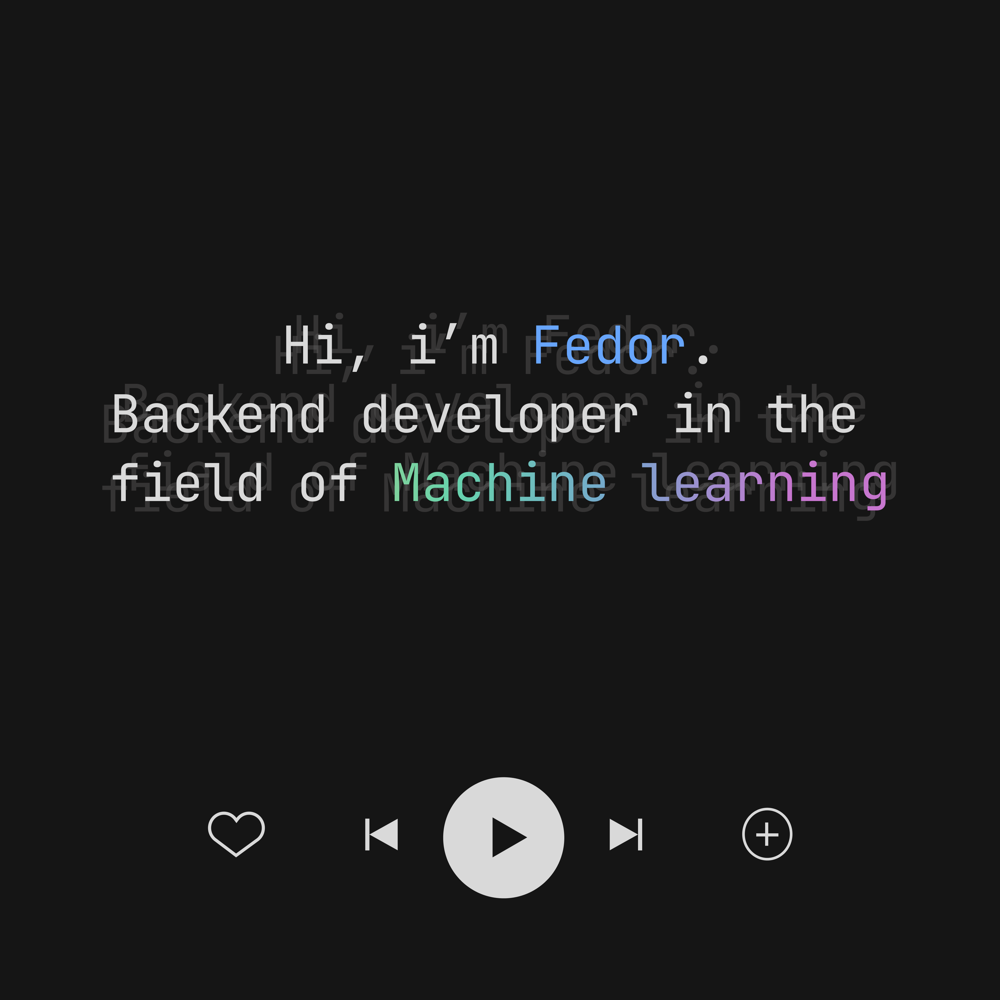

---

  
  

    
    
    
  

  

---
<h1 align="center">:one::zero::one:, the user :wave:</h1>

## :man_technologist: About Me:
I am a Junior Backend Developer from Russia.
- :telescope: I’m working as a Backend Developer specializing in Python.
- :seedling: Currently learning Machine Learning.
- :zap: In my free time, I explore new programming languages and frameworks.
- :mailbox: How to reach me: 
---

<!-- Репозиторий с бейджами и инструкцие по использованию - https://github.com/Ileriayo/markdown-badges -->
## :hammer_and_wrench: Languages and Tools :

<!-- Репозиторий для вывода статистики по GitHub - https://github.com/anuraghazra/github-readme-stats -->
---
<h2 align="left">:fire: My stats in GitHub</h2>

  
  

